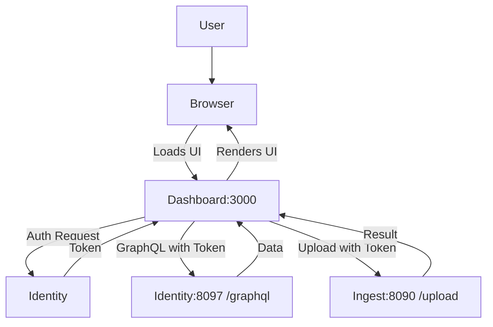

# dashboard

Landing app from where we can call multiple clients.

## Getting started

### Prerequisites

- Node.js (LTS version recommended)
- npm (comes with Node.js)

### Install dependencies

From the project root:

```bash
cd /Users/riyadennis/go/src/github.com/riyadennis/dashboard
npm install
```

### Run the app

Start the development server:

```bash
npm start
```

This will start the app (by default) at `http://localhost:3000` in your browser.

## Application flow



## GraphQL server dependency

This app expects a GraphQL server to be available at:

- `http://localhost:8097/graphql`

If you run the app via Docker Compose, the frontend is configured with:

- `REACT_APP_IDENTITY_URI=http://localhost:8097/graphql`

## REST upload dependency

File uploads expect a REST endpoint to be available at:

- `http://localhost:8090/upload`

## Test accounts

> For development only. Seed these with `docker/mysql/seed.sql` after running migrations.

| Name | Email | Password | Role | User ID |
|---|---|---|---|---|
| Admin User | admin@dashboard.com | Admin123! | ADMIN | 00000000-0000-0000-0000-000000000001 |
| Alice Smith | alice@dashboard.com | User123! | USER | 00000000-0000-0000-0000-000000000002 |
| Bob Jones | bob@dashboard.com | User456! | USER | 00000000-0000-0000-0000-000000000003 |

To seed:

```bash
docker exec -i react-mysql-server-1 \
  mysql -u identity-server -ppassword identity-server < docker/mysql/seed.sql
```
